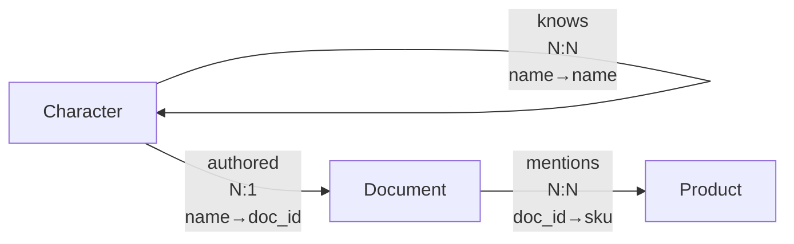

# 重构 get-knowledge-schema 为知识库介绍

## 设计评估

### 当前状态

`get_knowledge_schema` 工具目前仅返回 JSON 格式：

* `full_bundle_schema`: JSON Schema 用于校验导入数据

* `example_yaml`: YAML 示例

### 新设计方案

将 `get_knowledge_schema` 重命名为 `get-knowledge-intro`，返回 **Markdown 格式** 的知识库介绍：

````markdown
# 知识库介绍

## 使用说明

这是一个测试知识库，用于验证 DuckKB 的所有核心功能。

支持的操作：
- 节点 CRUD：Character, Document, Product
- 边 CRUD：knows, authored, mentions
- 搜索：混合搜索、向量搜索、全文搜索
- SQL 查询：只读 SQL 查询

## 导入数据格式

### JSON Schema

```json
{
  "$schema": "http://json-schema.org/draft-07/schema#",
  "title": "DuckKB Knowledge Bundle Schema",
  ...
}
````

### YAML 示例

```yaml
- type: Character
  name: "your-name"
  bio: "..."
```

## 表结构

### 节点表

#### Character (characters)

```sql
CREATE TABLE IF NOT EXISTS characters (
    __id BIGINT PRIMARY KEY,
    __created_at TIMESTAMP,
    __updated_at TIMESTAMP,
    __date DATE GENERATED ALWAYS AS (CAST(__updated_at AS DATE)) STORED,
    name VARCHAR,
    age BIGINT,
    bio VARCHAR,
    ...
);
```

### 边表

#### knows (edge\_knows)

```sql
CREATE TABLE IF NOT EXISTS edge_knows (
    __id BIGINT PRIMARY KEY,
    __from_id BIGINT NOT NULL,
    __to_id BIGINT NOT NULL,
    ...
);
```

### 系统表

#### \_sys\_search\_index

```sql
CREATE TABLE IF NOT EXISTS _sys_search_index (
    source_table VARCHAR NOT NULL,
    source_id BIGINT NOT NULL,
    ...
);
```

## 知识图谱关系

### 关系详情

| 边名称      | 起始节点      | 目标节点      | 基数  | 起始节点标识  | 目标节点标识  |
| -------- | --------- | --------- | --- | ------- | ------- |
| knows    | Character | Character | N:N | name    | name    |
| authored | Character | Document  | N:1 | name    | doc\_id |
| mentions | Document  | Product   | N:N | doc\_id | sku     |

### 关系图



````

### 设计优点

1. **人类可读**：Markdown 格式对 AI Agent 和开发者都友好
2. **结构清晰**：使用标题层级组织信息
3. **代码高亮**：SQL、YAML、JSON 都有语法高亮
4. **知识图谱详细**：表格 + Mermaid 图双重展示关系详情
5. **命名简化**：`import-knowledge-bundle` → `import`

### 需要修改的文件

1. `src/duckkb/core/mixins/ontology.py`
   - 新增 `get_knowledge_intro()` 方法，返回 Markdown 字符串
   - 新增 `_format_relationship_table()` 方法 - 生成关系详情表格
   - 新增 `_generate_mermaid_knowledge_graph()` 方法 - 展示知识图谱语义关系

2. `src/duckkb/mcp/duck_mcp.py`
   - 重命名工具 `get_knowledge_schema` → `get_knowledge_intro`
   - 重命名工具 `import_knowledge_bundle` → `import`
   - 更新工具描述

3. `src/duckkb/cli/duck_typer.py`
   - 重命名命令 `get-knowledge-schema` → `get-knowledge-intro`
   - 重命名命令 `import-knowledge-bundle` → `import`
   - 更新命令描述

4. `tests/test_mcp.py`
   - 更新测试用例

5. `tests/test_cli.py`
   - 更新测试用例

6. `tests/test_ontology.py`
   - 新增 `get_knowledge_intro` 测试

## 实现细节

### 1. usage_instructions

从 `config.yaml` 的 `usage_instructions` 字段读取。

### 2. import_schema

复用现有的 `get_bundle_schema()` 方法，格式化为 Markdown。

### 3. table_schemas

复用现有的 `_generate_node_ddl()` 和 `_generate_edge_ddl()` 方法。

### 4. 关系详情表格

生成 Markdown 表格，展示每条边的详细信息：

```python
def _format_relationship_table(self) -> str:
    """生成关系详情表格。"""
    lines = [
        "### 关系详情\n",
        "| 边名称 | 起始节点 | 目标节点 | 基数 | 起始节点标识 | 目标节点标识 |",
        "|--------|----------|----------|------|--------------|--------------|",
    ]
    
    for edge_name, edge_def in self.ontology.edges.items():
        from_node = edge_def.from_
        to_node = edge_def.to
        cardinality = edge_def.cardinality
        
        from_identity = ", ".join(self.ontology.nodes[from_node].identity)
        to_identity = ", ".join(self.ontology.nodes[to_node].identity)
        
        lines.append(
            f"| {edge_name} | {from_node} | {to_node} | {cardinality} | "
            f"{from_identity} | {to_identity} |"
        )
    
    return "\n".join(lines)
````

**输出示例：**

```markdown
| 边名称 | 起始节点 | 目标节点 | 基数 | 起始节点标识 | 目标节点标识 |
|--------|----------|----------|------|--------------|--------------|
| knows | Character | Character | N:N | name | name |
| authored | Character | Document | N:1 | name | doc_id |
| mentions | Document | Product | N:N | doc_id | sku |
```

### 5. 知识图谱关系图

使用 Mermaid `graph` 语法，在边上标注基数和标识字段：

```python
def _generate_mermaid_knowledge_graph(self) -> str:
    """生成知识图谱关系的 Mermaid 图。"""
    lines = ["graph LR"]
    
    for edge_name, edge_def in self.ontology.edges.items():
        from_node = edge_def.from_
        to_node = edge_def.to
        cardinality = edge_def.cardinality
        
        from_identity = ", ".join(self.ontology.nodes[from_node].identity)
        to_identity = ", ".join(self.ontology.nodes[to_node].identity)
        
        # 边标签：边名称 + 基数 + 标识字段映射
        label = f"{edge_name}<br/>{cardinality}<br/>{from_identity}→{to_identity}"
        
        lines.append(f'    {from_node} -- "{label}" --> {to_node}')
    
    return "\n".join(lines)
```

**输出示例：**


### 6. 完整 Markdown 生成

````python
def get_knowledge_intro(self) -> str:
    """生成知识库介绍的 Markdown 文档。"""
    sections = [
        "# 知识库介绍\n",
        self._format_usage_instructions(),
        self._format_import_schema_as_markdown(),
        "## 表结构\n",
        self._format_node_tables_as_markdown(),
        self._format_edge_tables_as_markdown(),
        self._format_system_tables_as_markdown(),
        "## 知识图谱关系\n",
        self._format_relationship_table(),
        "### 关系图\n",
        f"```mermaid\n{self._generate_mermaid_knowledge_graph()}\n```",
    ]
    return "\n".join(sections)
````

## 任务列表

1. [ ] 在 `ontology.py` 中实现 `get_knowledge_intro()` 方法
2. [ ] 实现 `_format_usage_instructions()` 方法
3. [ ] 实现 `_format_import_schema_as_markdown()` 方法
4. [ ] 实现 `_format_node_tables_as_markdown()` 方法
5. [ ] 实现 `_format_edge_tables_as_markdown()` 方法
6. [ ] 实现 `_format_system_tables_as_markdown()` 方法
7. [ ] 实现 `_format_relationship_table()` 方法
8. [ ] 实现 `_generate_mermaid_knowledge_graph()` 方法
9. [ ] 更新 `duck_mcp.py` 中的工具注册
10. [ ] 更新 `duck_typer.py` 中的 CLI 命令
11. [ ] 更新测试文件
12. [ ] 运行测试验证

## 风险评估

* **向后兼容性**：工具重命名可能影响现有 AI Agent 的调用

  * 建议：保留旧工具名 `get_knowledge_schema` 作为别名（调用新方法）

* **返回数据量**：Markdown 格式可能比 JSON 更长

  * 缓解：信息都是必要的，Markdown 格式更易解析

